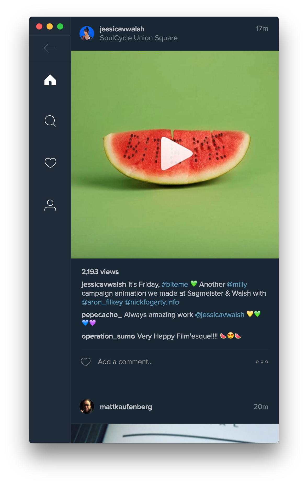

# Ramme 

> Unofficial Instagram Desktop App

[](https://github.com/terkelg/ramme/releases)
[]()
[](https://badge.fury.io/gh/terkelg%2Framme)
[](http://standardjs.com/)
[]()
[]()

<br>
[](https://github.com/terkelg/ramme/releases/latest)


## Features

### Background behavior

When closing the window, the app will continue running in the background, in the dock on macOS and the tray on Linux/Windows. Right-click the dock/tray icon and choose `Quit` to completely quit the app. On macOS, click the dock icon to show the window. On Linux, right-click the tray icon and choose `Toggle` to toggle the window. On Windows, click the tray icon to toggle the window.

### Dark mode
You can toggle dark mode in the Ramme menu or with <kbd>Cmd</kbd> <kbd>D</kbd> / <kbd>Ctrl</kbd> <kbd>D</kbd>.



Thanks for the help [@ninjaprawn](https://github.com/ninjaprawn)

### Keyboard shortcuts
- Go Back: <kbd>⌫</kbd>
- Refresh: <kbd>Cmd</kbd> <kbd>R</kbd> or <kbd>Ctrl</kbd> <kbd>R</kbd>
- Home: <kbd>Cmd</kbd> <kbd>1</kbd> or <kbd>Ctrl</kbd> <kbd>1</kbd>
- Discover: <kbd>Cmd</kbd> <kbd>2</kbd> or <kbd>Ctrl</kbd> <kbd>2</kbd>
- Notifications: <kbd>Cmd</kbd> <kbd>3</kbd> or <kbd>Ctrl</kbd> <kbd>3</kbd>
- Profile: <kbd>Cmd</kbd> <kbd>4</kbd> or <kbd>Ctrl</kbd> <kbd>4</kbd>
- Scroll a post up: <kbd>Shift</kbd> <kbd>Up</kbd>
- Scroll a post down: <kbd>Shift</kbd> <kbd>Down</kbd>
- Toggle Dark mode: <kbd>Cmd</kbd> <kbd>D</kbd> or <kbd>Ctrl</kbd> <kbd>D</kbd>

## Install

*macOS 10.9+, Windows 7+ & Linux are supported.*

### macOS

#### [Homebrew Cask](http://caskroom.io)

```
$ brew update && brew tap caskroom/cask && brew cask install ramme
```

#### Manually

[**Download**](https://github.com/terkelg/ramme/releases/latest), unzip, and move `Ramme.app` to the `/Applications` directory.

### Linux

[**Download**](https://github.com/terkelg/ramme/releases/latest) and unzip to some location.

To add a shortcut to the app, create a file in `~/.local/share/applications` called `ramme.desktop` with the following contents:

```
[Desktop Entry]
Name=Ramme
Exec=/full/path/to/folder/Ramme
Terminal=false
Type=Application
Icon=/full/path/to/folder/Ramme/resources/app/static/icon.png
```

### Windows

[**Download**](https://github.com/terkelg/ramme/releases/latest) and unzip to some location.

[**Installer for Windows (source)**](https://github.com/VoOoLoX/ramme-installer-windows) - [**Installer for Windows download**](https://github.com/VoOoLoX/ramme-installer-windows/releases/download/v1.2.0/Ramme.Installer.exe) by VoOoLoX

---

## Roadmap

### Features under Consideration
- Video/Photo download
- Photo Upload
- Photo Zoom
- Stories Support
- Notifications

## Dev

Built with [Electron](http://electron.atom.io).

###### Commands

- Init: `$ npm install`
- Run: `$ npm start`
- Build macOS: `$ npm run build:macos`
- Build Linux: `$ npm run build:linux`
- Build Windows: `$ npm run build:windows`
- Build all: `$ brew install wine` and `$ npm run build` *(macOS only)*


## Related
Inspiration from the super human [Sindre Sorhus](https://github.com/sindresorhus).
Please check out his stuff:

- [Anatine](https://github.com/sindresorhus/anatine) - Pristine Twitter app
- [Caprine](https://github.com/sindresorhus/caprine) - Caprine Facebook Messenger app

## Thanks
Thanks to all contributors who helped make Ramme better! 🎉

## License
MIT © [Terkel Gjervig](https://terkel.com)

## End User License Agreement (EULA)
- You will not use this repository for sending mass spam or any other malicious activity
- We / You will not support anyone who is violating this EULA conditions
- Repository is just for learning / personal purposes thus should not be part of any service available on the Internet that is trying to do any malicious activity (mass bulk request, spam etc.)

## Legal
This code is in no way affiliated with, authorized, maintained, sponsored or endorsed by Instagram or any of its affiliates or subsidiaries. This is an independent and unofficial. Use at your own risk.
