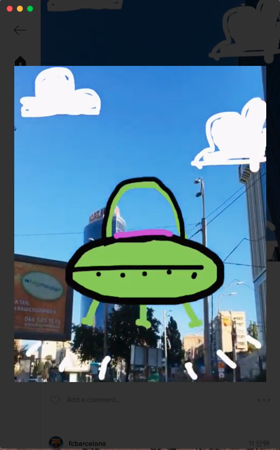

# Ramme(Stephen.Kingsley process) 

> Unofficial Instagram Desktop App

<br>
[](https://github.com/terkelg/ramme/releases/latest)


## Features

### Background behavior

When closing the window, the app will continue running in the background, in the dock on macOS and the tray on Linux/Windows. Right-click the dock/tray icon and choose `Quit` to completely quit the app. On macOS, click the dock icon to show the window. On Linux, right-click the tray icon and choose `Toggle` to toggle the window. On Windows, click the tray icon to toggle the window.

### Dark mode
You can toggle dark mode in the Ramme menu or with <kbd>Cmd</kbd> <kbd>D</kbd> / <kbd>Ctrl</kbd> <kbd>D</kbd>.


Thanks for the help [@ninjaprawn](https://github.com/ninjaprawn)

### Keyboard shortcuts
- Go Back: <kbd>⌫</kbd>
- Refresh: <kbd>Cmd</kbd> <kbd>R</kbd> or <kbd>Ctrl</kbd> <kbd>R</kbd>
- Home: <kbd>Cmd</kbd> <kbd>1</kbd> or <kbd>Ctrl</kbd> <kbd>1</kbd>
- Discover: <kbd>Cmd</kbd> <kbd>2</kbd> or <kbd>Ctrl</kbd> <kbd>2</kbd>
- Notifications: <kbd>Cmd</kbd> <kbd>3</kbd> or <kbd>Ctrl</kbd> <kbd>3</kbd>
- Profile: <kbd>Cmd</kbd> <kbd>4</kbd> or <kbd>Ctrl</kbd> <kbd>4</kbd>

### Pic hover

you can click on the right mouse button in the photo or the video and will show this



## Install

*macOS 10.9+, Windows 7+ & Linux are supported.*

### macOS

#### [Homebrew Cask](http://caskroom.io)

```
$ brew update && brew tap caskroom/cask && brew cask install ramme
```

#### Manually

[**Download**](https://github.com/terkelg/ramme/releases/latest), unzip, and move `Ramme.app` to the `/Applications` directory.

### Linux

[**Download**](https://github.com/terkelg/ramme/releases/latest) and unzip to some location.

To add a shortcut to the app, create a file in `~/.local/share/applications` called `ramme.desktop` with the following contents:

```
[Desktop Entry]
Name=Ramme
Exec=/full/path/to/folder/Ramme
Terminal=false
Type=Application
Icon=/full/path/to/folder/Ramme/resources/app/static/Icon.png
```

### Windows

[**Download**](https://github.com/terkelg/ramme/releases/latest) and unzip to some location.


---

## Roadmap

### v2.2
- Bugs ... Gotta Catch 'Em All!

### v3
- Pull to refresh
- Photo Zoom

### Under Consideration
- Auto Update
- Video/Photo download
- Photo Upload
- Stories Support

## Dev

Built with [Electron](http://electron.atom.io).

###### Commands

- Init: `$ npm install`
- Run: `$ npm start`
- Build macOS: `$ npm run build:macos`
- Build Linux: `$ npm run build:linux`
- Build Windows: `$ npm run build:windows`
- Build all: `$ brew install wine` and `$ npm run build` *(macOS only)*


## Related
Inspiration from the super human [Sindre Sorhus](https://github.com/sindresorhus).
Please check out his stuff:

- [Anatine](https://github.com/sindresorhus/anatine) - Pristine Twitter app
- [Caprine](https://github.com/sindresorhus/caprine) - Caprine Facebook Messenger app

## License

MIT © [Terkel Gjervig](https://terkel.com)
